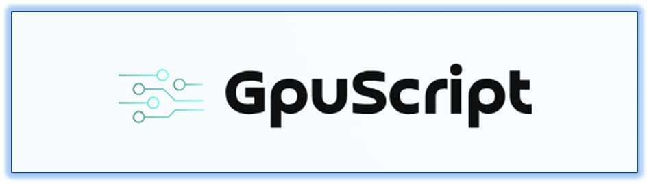

# GS - GpuScript :rocket:

GpuScript turns a laptop into a supercomputer, bringing C# Object-Orientated Programming and full debugging support to the GPU. Basically, any programmer can quickly write and easily debug large complex programs on the GPU, including both computation and graphics, and obtain supercomputer speeds.

Any C# programmer can now program any GPU on a laptop or desktop without learning CUDA, HLSL, or other GPU computation or graphics languages.

GpuScript is integrated with Unity. Unity supports numerous platforms, including Windows, Mac, Linux, Dedicated Server, Android, IOS, PS4, PS5, Web, Universal Windows Platform, tvOS, and visionOS, with practically no code changes required from platform to platform. Unity supports multi-user applications, enabling custom GPU Cloud distributed computing. Unity also supports high-quality 3D graphics and simulations. Unity is free, has a wide user-base, and many training videos are available. In my experience, if you don't use Unity, you end up having to rewrite it yourself, feature by feature.

## Project Status:

GpuScript is now a v1.0 released product. If you find a bug, create a new [Issue](https://github.com/Alan-Rock-GS/GS/issues).

The framework is cross-platform. We will be targeting the latest version of Unity, Unity 6. 

## Getting Started

There will be a growing list of demos and tutorials that you can clone and run to get a feel for how GpuScript works. Start with the Instant_Gratification [Tutorial](https://www.youtube.com/@GpuScript/playlists). Go to the channel's "GpuScript Tutorial" Playlist to find all tutorials available.

## Available Libraries

* <ins>BDraw<ins>: Draw hundreds of millions of billboard/semi-billboard graphics in high-speed, including spheres, lines, arrows, and 3D text.
* <ins>AppendBuff<ins>: High-speed and high-volume append buffers and prefix sums, with many use cases.

## More to come:

* Backup: Backup files to local and/or external locations
* FFT: Fastest Fourier Transform in existence
* OCam: Orbit camera with legends.
* Project: Project manager.
* Puppeteer: Automate Chrome for numerous web applications, such as web scraping and bypassing APIs (not responsible for illegal usage).
* Rand: Fastest random number generator in existence.
* Report: Generate reports and documentation with tables, figures, and animations. Full automation of all program features from an instruction file.
* Cloud: Multi-user/multi-process support for distributed GPU computing. Provides >5X acceleration using a single laptop with a single GPU. Even faster for local area networks and over the internet.
* VGrid: Fastest 3D volumetric rendering in existence, with axes grids.
* Views: Customized camera views and other program settings
* GEM: AI neural network with instantaneous and automatic construction of all hidden layers, size of each layer, and all neuron connections. Instant training with optimal fitting, interpolation, and extrapolation. Instant thinking. Data correction to fill in unknown entries, automatic detection and correction of outliers, and fixing jitter caused by roundoff or scatter. Optimization, to find the least number of training examples that can interpolate or extrapolate the entire set. Also supports correlated inputs for predictive analytics, statistics, design optimization, process control, and much more.
* Matrix: Fastest matrix multiplication in existence for a GPU (23 PFLOPS on a common GPU released in 2020). Combined with GEM, results in the fastest matrix inversion in existence. Yes, GEM can perform accurate matrix operations.

## Contact Info

Alan Rock stared the GpuScript project because of his belief in open-soure and contributing to the community. Here are a few places you can find Alan or more information about GpuScript:

* [Alan on X](https://x.com/Alan_Rock_GS)
* [Alan on LinkedIn](https://www.linkedin.com/in/alan-rock-8062921/)
* [GpuScript on X](https://x.com/GpuScript)
* [GpuScript website](https://GpuScript.com/)
"# GpuScript" 
"# GpuScript" 
